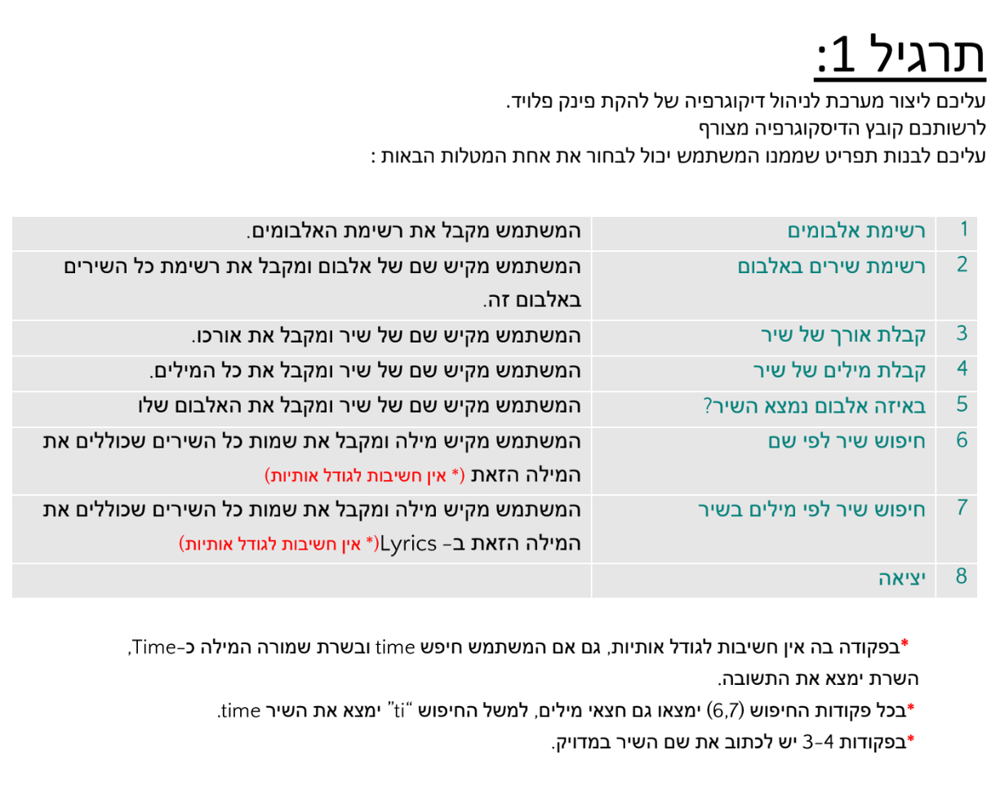
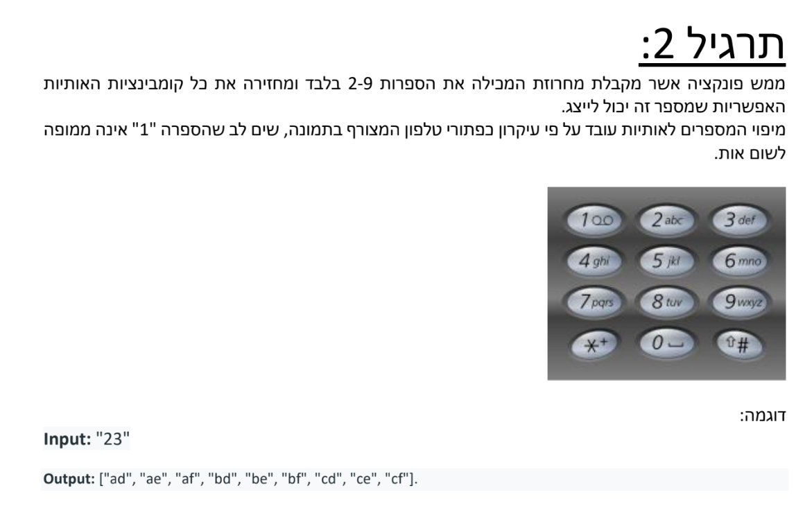

# Home assignment `Magshimim`
<br/>
<br/>
<br/>
<br/>


# Exercise - 1




## Pink Floyd Song Serach Application

This document outlines the features available in the Pink Floyd Song Serach application.

1. **List of Albums**
   - Users can view a list of Pink Floyd albums.

2. **List of Songs in an Album**
   - By entering the name of an album, users can retrieve a list of all songs contained within that album.

3. **Get the Length of a Song**
   - Users can find out the length of a specific song by typing its name.

4. **Get the Lyrics of a Song**
   - By typing the name of a song, users can access its full lyrics.

5. **In Which Album is the Song**
   - Users can discover which album a particular song belongs to by entering the song's name.

6. **Search for a Song by Name**
   - Users can search for songs by typing a word or phrase. The search returns all song names that include the typed word, ignoring case sensitivity.

7. **Search for a Song by Lyrics**
   - Similar to searching by name, users can type a word or phrase to find all songs whose lyrics contain the specified word, regardless of case sensitivity.

8. **Exit**
   - Users can exit the application.


REST Implementation 

| Feature Number | Description | HTTP Method | Route Endpoint |
|----------------|-------------|-------------|----------------|
| 1              | View a comprehensive list of albums | `GET` | `/albums` |
| 2              | Retrieve a list of all songs in a specified album | `GET` | `/albums/<album_name>/songs` |
| 3              | Find out the length of a specific song | `GET` | `/songs/<song_name>/length` |
| 4              | Access the full lyrics of a specific song | `GET` | `/songs/<song_name>/lyrics` |
| 5              | Discover which album a particular song belongs to | `GET` | `/songs/<song_name>/album` |
| 6              | Search for songs by name | `GET` | `/search/songs?name=<word>` |
| 7              | Search for songs by lyrics | `GET` | `/search/songs?lyrics=<word>` |
| 8              | Exit - the init JWT will be expired and a new one will be genrated  | `POST` | `/exit` |


Schema from `Pink_Floyd_DB.txt`

```text
 # [Folow by the album name]::[Published year]
   (Optinal){
      
  }
 *[Song name]::[singer]::[duration ]::[First line on the song]
 ...
 [Last line on the song]
  *[Song name]::[singer]::[duration ]::[First line on the song]


  ....
 # Next Alboom ...
```


Load into one data structure (dict) :
 

<br/>
<br/>

# Exercise - 2


